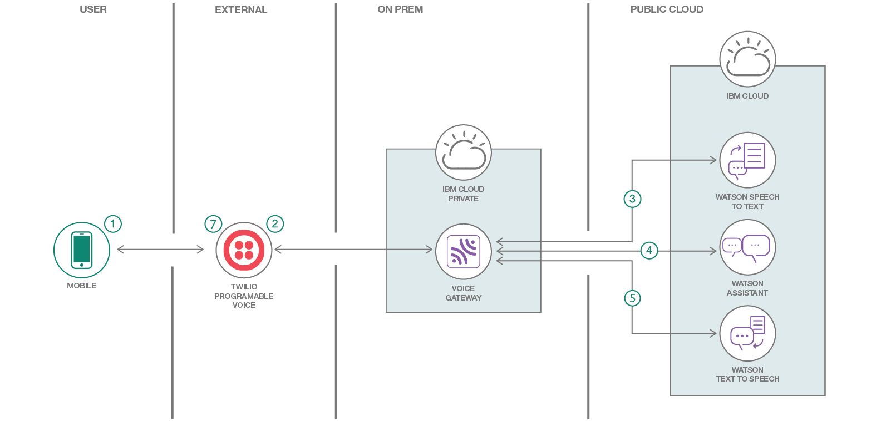

# Automating Call Centers with Voice Gateway on IBM Cloud Private

This code pattern is a Voice Gateway application that enables companies to automate their call centers using Watson Assistant, Text to Speech, and Speech to Text, without having to orchestrate between all the different services yourself; the Voice Gateway will do that for you.

When the reader has completed this Code Pattern, they will understand how to:

* Deploy the Voice Gateway on an IBM Cloud Private Instance
* Connect the Voice Gateway to Twilio via the SIP communication protocol
* Use a Service Orchestration Engine with the Voice Gateway

## Flow

1. User phones a call center phone number, associated with a Twilio account.
2. The Twilio number connects to a configured Voice Gateway service via the SIP communication protocol. Voice Gateway is running on IBM Cloud Private.
3. Voice Gateway calls Watson Speech to Text to transcribe user input.
4. Based on user input, certain flows in Watson Assistant will be triggered.
5. Any results from Watson Assistant will be transmitted back to the Voice Gateway service via Watson Text to Speech.
6. Voice Gateway will sends the audio back to the Twilio Programmable Voice service.
7. The resulting audio is played back to the user.

## Included components

* [IBM Cloud Private](https://www.ibm.com/cloud/private): An on-prem version of IBM Cloud to store your sensitive data and applications.
* [IBM Voice Gateway](https://www.ibm.com/support/knowledgecenter/en/SS4U29/welcome_voicegateway.html): A service that enables you to build apps that leverage Assistant, Text to Speech, and Speech to Text, without having to tie them all in manually.
* [Watson Assistant](https://www.ibm.com/watson/developercloud/conversation.html): Create a chatbot with a program that conducts a conversation via auditory or textual methods.
* [Watson Text to Speech](https://www.ibm.com/watson/developercloud/text-to-speech.html): Converts written text into natural sounding audio in a variety of languages and voices.
* [Watson Speech to Text](https://www.ibm.com/watson/developercloud/speech-to-text.html): A service that converts human voice into written text.
* [Twilio](https://console.ng.bluemix.net/catalog/services/twilio): Integrate voice, messaging, and VoIP into your web and mobile apps.
* [Flask](http://flask.pocoo.org/): is a micro web framework.

## Featured Technologies

* [Artificial Intelligence](https://medium.com/ibm-data-science-experience): Artificial intelligence can be applied to disparate solution spaces to deliver disruptive technologies.
* [Python](https://www.python.org/): Python is a programming language that lets you work more quickly and integrate your systems more effectively.

<!--
# Watch the Video

-->

## Prerequisites

* **A Twilio account**: [Sign up for free].(https://www.twilio.com/try-twilio)
* **A running IBM Cloud Private**: Run the Community Edition using [these steps](https://github.com/IBM/deploy-ibm-cloud-private).

## Steps

1. Create Watson services on IBM Cloud
2. Import the conversation into Watson Assistant
3. Deploy the Voice Gateway on IBM Cloud Private
4. Configure Voice Gateway and Twilio
5. Call the Twilio phone number

### 1. Create Watson services on IBM Cloud

Start by heading over to your IBM Cloud catalog and creating the three services listed below:

* [Watson Assistant](https://console.ng.bluemix.net/catalog/services/conversation/)
* [Watson Speech to Text](https://console.bluemix.net/catalog/services/speech-to-text/)
* [Watson Text to Speech](https://console.bluemix.net/catalog/services/text-to-speech/)

### 2. Import the conversation into Watson Assistant

Now, setup your chatbot - you can either create your own chatbot, use the sample workspace provided in this code pattern, located in [data/workspace.json](data/workspace.json). Use the Watson Assistant tooling to import the dialog to a new workspace.

### 3. Deploy the Voice Gateway on IBM Cloud Private

The interface of IBM Cloud Private is, of course, very similar to that of IBM Cloud (public); so you should find it easy to navigate this interface if you're familiar with IBM Cloud.

Head over to the Catalog, and either search for, or scroll down to, the `ibm-voice-gateway-dev` tile. Click on the tile, and then click _Configure_.

You can then enter a _Release name_ (the name of your service), a _Target namespace_ (where to store this service), and then read the license agreements. If you agree, check the checkbox.

Finally, you can ignore all of the fields in the following form except for the Watson API Credential fields - go ahead and fill them all out (Assistant, STT, TTS). Once you fill out these fields, you can click on the _Install_ button.

### 4. Configure Voice Gateway and Twilio

TODO: Steve, please fill this out as you're the expert at navigating the "documentation" for ICP.

## Sample output

TODO

## Links

TODO

## Learn more

* **Artificial Intelligence Code Patterns**: Enjoyed this Code Pattern? Check out our other [AI Code Patterns](https://developer.ibm.com/code/technologies/artificial-intelligence/).
* **AI and Data Code Pattern Playlist**: Bookmark our [playlist](https://www.youtube.com/playlist?list=PLzUbsvIyrNfknNewObx5N7uGZ5FKH0Fde) with all of our Code Pattern videos
* **With Watson**: Want to take your Watson app to the next level? Looking to utilize Watson Brand assets? [Join the With Watson program](https://www.ibm.com/watson/with-watson/) to leverage exclusive brand, marketing, and tech resources to amplify and accelerate your Watson embedded commercial solution.

## License

[Apache 2.0](LICENSE)
